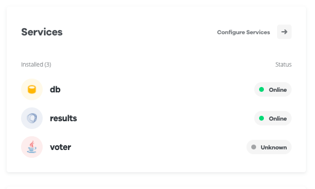

# Liferay

It's time for the third service - the result viewer. Let's add Liferay to the party!

## Portlet

What we need, basically, is a simple portlet that consumes the data collection and fetches the results. To make things simpler, we will use just JavaScript for all that.

Again, WeDeploy has a prepared WeDeploy image of Liferay DXP. What we have to do is the following:

+ Define a new service and choose Liferay DXP image
+ Map a volume to `deploy` subfolder, so we can leverage Liferay's auto-deployment feature
+ Build a portlet

## Configuring

The first two steps are very easy with WeDeploy. It's all about adding a new folder and configuring the `wedeploy.json`:

```json
{
	"id": "results",
	"image": "wedeploy/liferay:dxp-sp4-20170825",
	"memory": 4096,
	"cpu": 3,
	"volume": "/opt/liferay"
}
```

We are already familiar with the `id` and `image`. The new configuration parameters are self-explanatory. We need to raise the memory and CPU usage as DXP portal simply requires more power. Finally, the `volume` flag tells WeDeploy where to map the `$LIFERAY_HOME`.

Now we are ready to develop a plugin.

## Plugin

As you can expect, there is a boilerplate code for that. ;) Checkout the following repo:

```shell
git clone https://github.com/wedeploy/tutorial-liferay-dxp results
```

For the purpose of the workshop, we are going to cheat. :) We will just add the JavaScript and HTML code in the jar without rebuilding everything. Unpack the jar to `src` folder and go to `src/META-INF/resources` folder. There is `view.jsp` - the view content of the portlet. This is the place where we're going to add our code.

The code is rather simple. We use the Wedeploy JavaScript API to fetch the data from our data collection. Then we populate the page with the data. Simple as that.

Repack the jar, put it in the `deploy` folder - remember, this is actually the `$LIFERAY_HOME/deploy` folder.

We are ready to deploy another service!

## Deployment

Just like last time:

```shell
cd results
we deploy -p devcon
```

Done!



However, one thing is different now. Liferay needs some initial time to boot that is quite long. So we just need to wait for it to gets up and load our plugin.

---

[continue...](06-the-end.md)